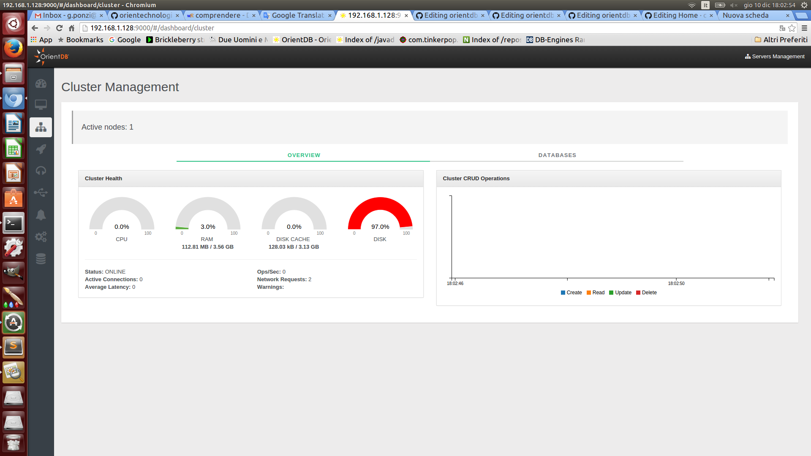
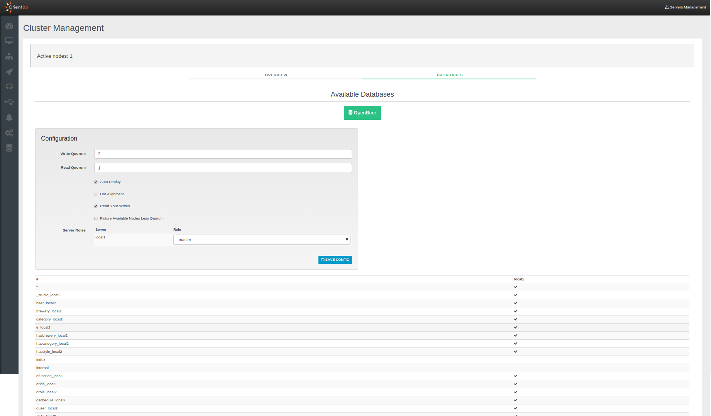

# Cluster Management (Enterprise only)
This is the section to work with OrientDB Cluster as DBA/DevOps. This is an exclusive feature introduced in OrientDB 2.2 Studio specifically for the [Enterprise Edition](http://orientdb.com/enterprise/).

On the top of the page are reported the number of active nodes joining your cluster.

## Overview
This page summarizes all the most important information about the current server and the other servers connected in cluster if any:
- `Server status`
- `Operations per second`
- `Active Connections`
- `Warnings`
- `CPU`, `RAM` and `DISK` used
- `Live chart` with CRUD operations in real-time

## Databases
In this panel you can see all databases present on each server joining your cluster.
Through the configuration box above you can change in real time the current cluster configuraton, setting the following parameters:
- `Write Quorum`
- `Read Quorum`
- `Auto Deploy`
- `Hot Alignment`
- `Read your Writes`
- `Failure Available Nodes Less Quorum`
- `Server Roles`, roles may be "Master" or "Replica"

If you want know more about these configuration parameters view the [Distributed Configuration](https://github.com/orientechnologies/orientdb-docs/blob/master/Distributed-Configuration.md) page.

