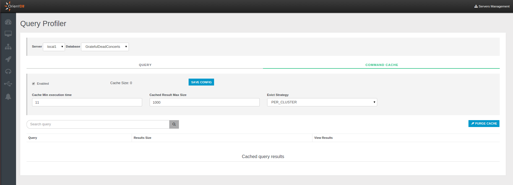

# Query Profiler (Enterprise only)
Studio 2.2 includes a new functionality called [Auditing](Auditing.md). To understand how Profiler works, please read the [Profiler](https://github.com/orientechnologies/orientdb-docs/blob/master/Profiler.md) page on the [OrientDB Manual](http://orientdb.com/docs/last/index.html).

In the bottom section you can choose the server in order to investigate queries executed on it and manage the local cache.

## Query
This panel shows all the query executed on a specific server grouped by command content. For each query the following information are reported:
- `Type`, the query type
- `Command`, the content of the query
- `Users`, the users who executed the query
- `Entries`, number of entries
- `Average`,
- `Total`,
- `Max`,
- `Min`,
- `Last`,
- `Last execution`, the timestamp of the query last execution

## Command Cache
Through this panel you can manage the cache of the specific server and consult the cached results to the queries.
You can filter the queries by ? and purge the whole cache.

