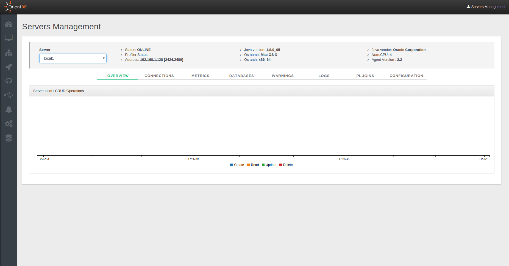
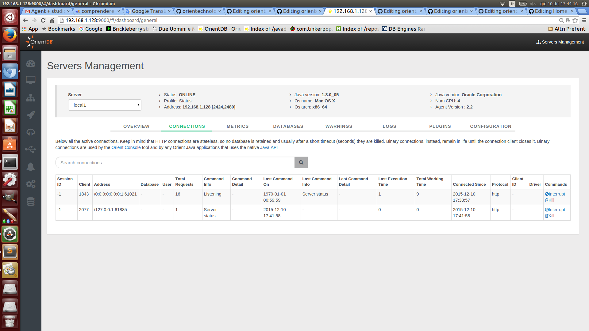
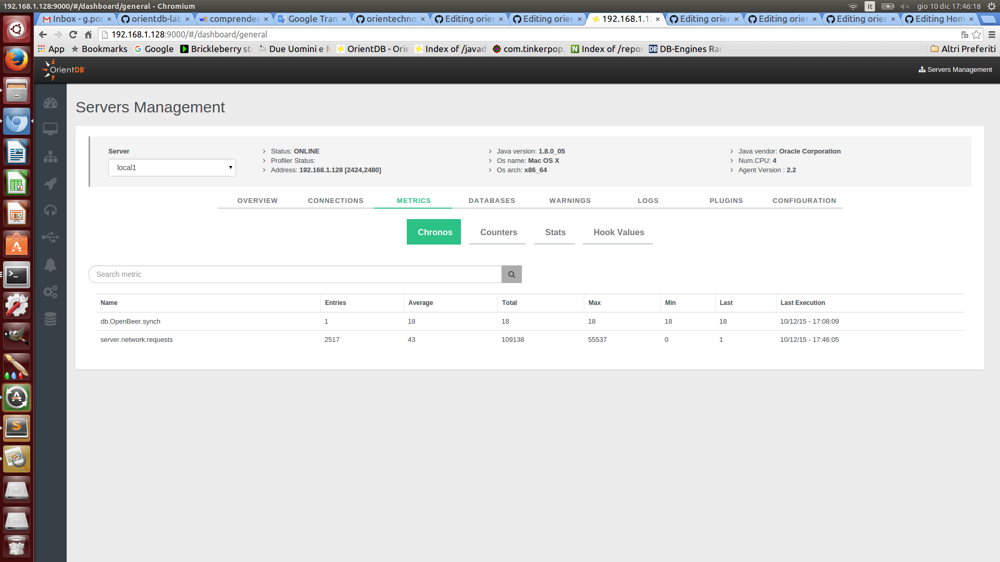
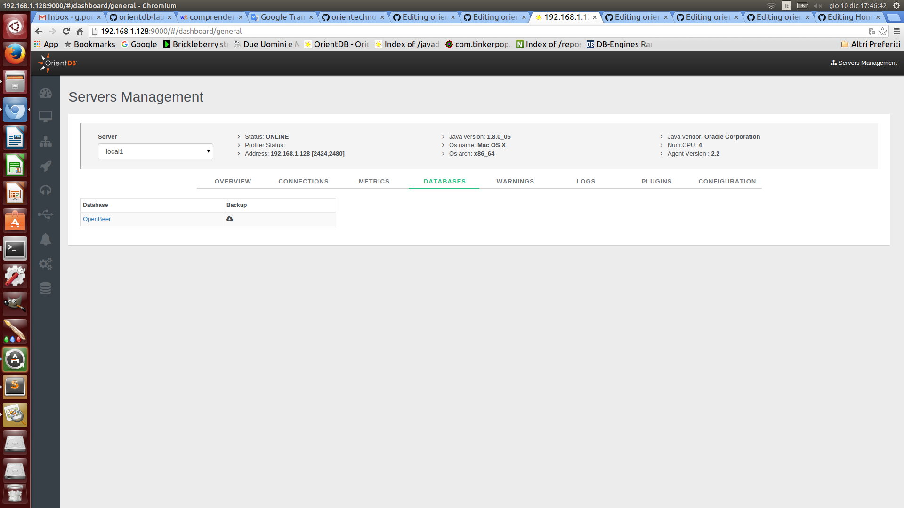
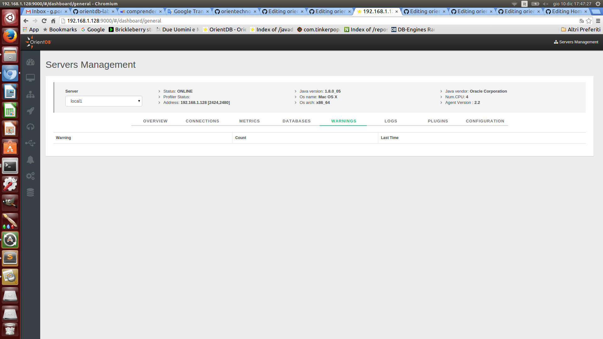
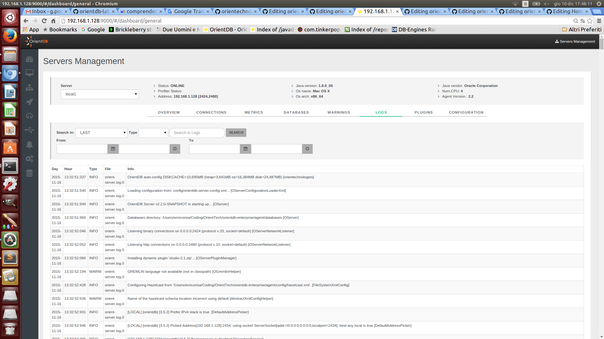
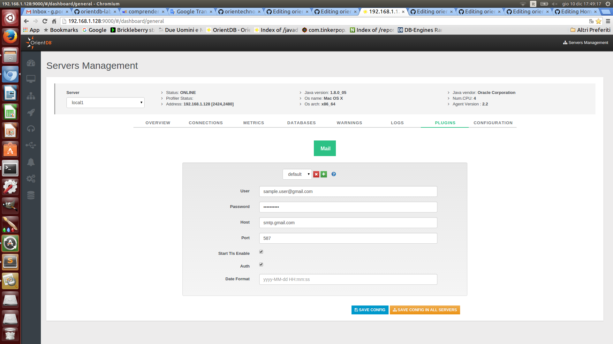
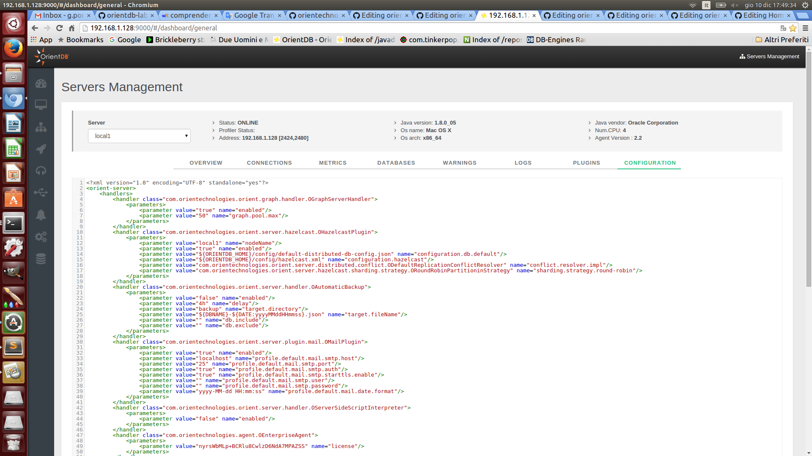

# Server Management
This is the section to work with OrientDB Server as DBA/DevOps. This control panel coming from OrientDB 2.1 Studio has been enriched with several new features for the new [Enterprise Edition](http://orientdb.com/enterprise/).

On the top of the page you can chose your server and then navigate all statistics and information related to it.

## Overview
This page summarizes all the most important information about the current server and the other servers connected in cluster if any:
- `Server status`
- `Operations per second`
- `Active Connections`
- `Warnings`
- `CPU`, `RAM` and `DISK` used
- `Live chart` with CRUD operations in real-time

## Connections
Displays all the active connections to the server. Each connection reports the following information:
- `Session ID`, as the unique session number
- `Client`, as the unique client number
- `Address`, is the connection source
- `Database`, the database name used
- `User`, the database user
- `Total Requests`, as the total number of requests executed by the connection
- `Command Info`, as the running command
- `Command Detail`, as the detail about the running command
- `Last Command On`, is the last time a request has been executed
- `Last Command Info`, is the informaton about last operation executed
- `Last Command Detail`, is the informaton about the details of last operation executed
- `Last Execution Time`, is the execution time o last request
- `Total Working Time`, is the total execution time taken by current connection so far
- `Connected Since`, is the date when the connection has been created
- `Protocol`, is the protocol between [HTTP](OrientDB-REST.md) and [Binary](Network-Binary-Protocol.md)
- `Client ID`, a text representing the client connection
- `Driver`, the driver name

Each session can be interrupted or even killed.

## Metrics
This panel shows 

## Databases
This panel shows 

## Warnings
This panel shows 

## Logs
This panel shows 

## Plugins
This panel shows 

## Configuration
This panel shows 

